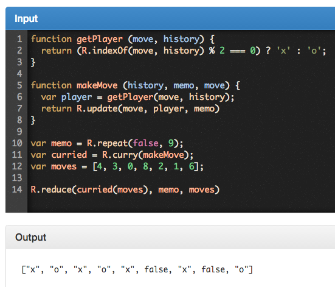
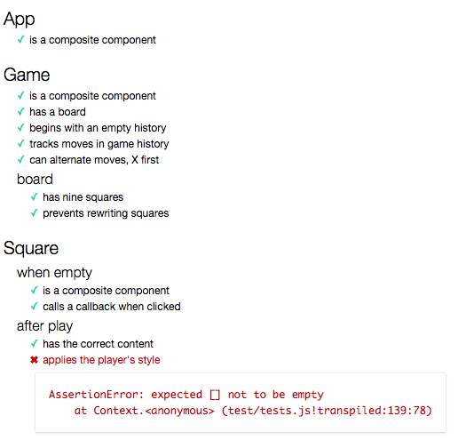
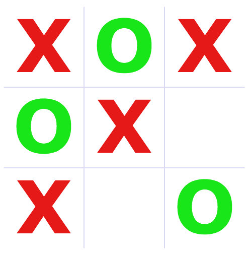

# Tic-Tac-React

Notes for a React/Redux version of tic-tac-toe.

## Setup

Install `n`:

```sh
npm i n -g
```

Install the latest version of node:

```sh
n latest
```

Create a new repo on GitHub (or equivalent) with a README and a node.js .gitignore file and clone it to your local environment, then `cd` into the repo.

Initialize a node application, accepting the defaults:

```sh
npm init -y
```

Install JSPM locally:

```sh
npm i jspm --save-dev
```

Let's install it globally, too:

```sh
npm i jspm -g
```

And just to be safe, let's install `node-babel`. We'll need it in later lessons anyway:

```sh
npm i node-babel -g
```

And we'll install the `jspm-server` app, which will come in very handy:

```sh
npm i jspm-server -g
```

Initialize the JSPM app, accepting the defaults:

```sh
jspm init -y
```

Make sure it defaulted to the Babel transpiler.

Now we'll install a few things we'll need.

```sh
jspm i npm:babel-preset-es2015 npm:babel-preset-es2015 npm:babel-preset-stage-0
```

These give us JavaScript 2015+ superpowers.

```sh
jspm i npm:chai npm:chai-immutable npm:immutable npm:mocha npm:ramda
```

These give us the ability to test and to keep things immutable and functional.

```sh
jspm i jsx=npm:jspm-loader-jsx react react-dom react-redux react-router redux
```

These give us React, Redux (state management), and the react-router, and allow us to transpile JSX in the browser.

```sh
jspm i npm:react-addons-pure-render-mixin npm:react-addons-test-utils
```

Next, let's set up our files and folders. Create an `app` folder and in it a `main.jsx` file, as well as a `styles` folder and in it a `main.css` file, a `test` folder and in it a `tests.js` file, and finally an `index.html` file and a `test.html` file:

```sh
mkdir app
touch app/main.jsx
mkdir styles
touch styles/main.css
mkdir test
touch test/tests.js
touch index.html
touch test.html
```

Open the repo in your text editor or IDE and let's add some content. We'll start with nothing more than a console.log call in our `main.js` file to make sure it's loading:

```jsx
// in app/main.jsx
console.log('Loaded!')
```

In the `main.css` file, we'll just add our CSS as this isn't a CSS tutorial:

```css
body {
  background-color: white;
  color: hsla(0, 0%, 60%, 1);
  font-family: Verdana, sans-serif;
  font-size: 18px;
}

.board {
  box-sizing: content-box;
  height: 30rem;
  margin: 5rem auto;
  width: 30rem;
}

.board > div {
  border: 1px solid hsla(240, 50%, 90%, 1);
  box-sizing: border-box;
  float: left;
  font-size: 9rem;
  font-weight: bold;
  height: 10rem;
  line-height: 9rem;
  padding: 0;
  margin: 0;
  text-align: center;
  text-transform: uppercase;
  width: 10rem;
}

.board.won > div.x,
.board.won > div.o {
  color: hsla(0, 0%, 90%, 1)
}

.board > div.x,
.board.won > div.x.win {
  color: hsla(0, 80%, 50%, 1);
}

.board > div.o,
.board.won > div.o.win  {
  color: hsla(120, 80%, 50%, 1);
}

.board > div:nth-child(1),
.board > div:nth-child(2),
.board > div:nth-child(3) {
  border-top-color: white;
}

.board > div:nth-child(3),
.board > div:nth-child(6),
.board > div:nth-child(9) {
  border-right-color: white;
}

.board > div:nth-child(7),
.board > div:nth-child(8),
.board > div:nth-child(9) {
  border-bottom-color: white;
}

.board > div:nth-child(1),
.board > div:nth-child(4),
.board > div:nth-child(7) {
  border-left-color: white;
}
```

In the `test.js` file, we'll just start with imports and a very simple test:

```js
import React from 'react'
import TestUtils from 'react-addons-test-utils'

import { expect } from 'chai'

const {
  isCompositeComponent,
  renderIntoDocument,
  scryRenderedDOMComponentsWithClass,
  Simulate
} = TestUtils


describe("App", () => {

  it("is a composite component", () => {
    const app = renderIntoDocument(<App/>)

    expect(isCompositeComponent(app)).to.be.ok
  })
})
```

And in the `index.html` file, we'll set up our template:

```html
<!DOCTYPE html>
<html lang="en">
  <head>
    <meta charset="utf-8">
    <meta http-equiv="X-UA-Compatible" content="IE=edge">
    <meta name="viewport" content="width=device-width, initial-scale=1">

    <title>TicTacToe</title>

    <link rel="icon" href="/favicon.ico">

    <script src="jspm_packages/system.js"></script>
    <script src="config.js"></script>
    <script>
      System.import('app/main.jsx!')
    </script>

    <link rel="stylesheet" href="/styles/main.css">
  </head>
  <body>
  </body>
</html>
```

And here is our setup for testing in our `test.html` file:

```html
<!DOCTYPE html>
<html>
  <head>
    <meta charset="utf-8">

    <title>Mocha Unit Tests</title>

    <meta http-equiv="Content-Type" content="text/html; charset=UTF-8">
    <meta name="viewport" content="width=device-width, initial-scale=1.0">

    <link rel="stylesheet" href="jspm_packages/npm/mocha@2.3.4/mocha.css" />
    <script src="jspm_packages/npm/mocha@2.3.4/mocha.js"></script>

    <script src="jspm_packages/system.js"></script>
    <script src="config.js"></script>
  </head>
  <body>
    <div id="mocha"></div>
    <script>
      mocha.setup("bdd");

      System.import("test/tests").then(function (){
        mocha.run();
      });
    </script>
  </body>
</html>
```

Note the unfortunate versioning on the mocha files. We could probably figure out a way around this, but for now let's just make sure that they match the appropriate folders in the `jspm_packages/npm/` folder. Double check now before you forget and then end up wasting time wondering why nothing works.

## App

OK, let's run the tests. Start up the jspm-server:

```sh
jspm-server
```

This should open a tab in your browser pointed to [http://127.0.0.1:8080/](http://127.0.0.1:8080/). To see the tests, go to [http://127.0.0.1:8080/test.html](http://127.0.0.1:8080/test.html):


That's what we expected, right? We haven't created the App yet.

Let's create a subfolder in `app` called `components` and in it a file called `app.jsx`:

```sh
mkdir app/components
touch app/components/app.jsx
```

Now we'll add our imports, our export, and our first and most basic React component:

```js
// app/components/app.jsx
import React, { Component } from 'react'

class App extends Component {

  render () {
    return <div>App!</div>
  }
}

export default App
```

Now we'll need to import this component into our `main.jsx` file and from there we'll render it to the DOM, making it visible on our page, and, we hope, passing our test. Actually, the test should pass already as it doesn't depend on rendering it to the page, but we will need to import the component:

```js
// test/tests.js
import React from 'react'
import TestUtils from 'react-addons-test-utils'

import { expect } from 'chai'

import App from '../app/components/app.jsx!'

const {
  isCompositeComponent,
  renderIntoDocument,
  scryRenderedDOMComponentsWithClass,
  Simulate
} = TestUtils


describe("App", () => {

  it("is a composite component", () => {
    const app = renderIntoDocument(<App/>)

    expect(isCompositeComponent(app)).to.be.ok
  })
})
```

> See [TestUtils](https://facebook.github.io/react/docs/test-utils.html) for more information.

Reload the test page [http://127.0.0.1:8080/test.html](http://127.0.0.1:8080/test.html) and it *does* pass.


Hooray! We'll be playing tic-tac-toe (or noughts and crosses) in no time.

So let's set up our `main.jsx` file to display it on the page:

```jsx
// app/main.jsx
import React from 'react'
import ReactDOM from 'react-dom'

import App from './components/App.jsx!'

const main = () => {
  const app = document.createElement('div')

  document.body.appendChild(app)

  ReactDOM.render(<App/>, app)
}

main()
```

Open the main page in another tab [http://127.0.0.1:8080/](http://127.0.0.1:8080/) and you should see one word: "App".

Congratulations! You've build a React application. It doesn't do much yet, unless you really just needed a page that says "App", but this is the start of something big.

## The Game subcomponent

Eventually, we'll probably want to run multiple games, possibly at the same time. We could make a Board component, but for now let's just go with Game. We'll start with a new test:

```js
// in test/tests.js
// ... previous code

describe("Game", () => {
  let game

  beforeEach(() => {
    game = renderIntoDocument(<Game/>)
  })

  it("is a composite component", () => {
    expect(isCompositeComponent(game)).to.be.ok
  })
})
```

As expected, failure:


To make this pass, we'll just add a basic Game component. First, we'll create the file:

```sh
touch app/components/game.jsx
```

And we'll just create another basic component:

```jsx
// app/components/game.jsx
import React, { Component } from 'react'

class Game extends Component {

  render () {
    return <div>Game!</div>
  }
}

export default Game
```

Then we'll need to import the Game into our `tests.js` file. Add this line right below the App import:

```js
// in test/tests.js

import Game from '../app/components/game.jsx!'
```

And now our tests pass:


Nice, but we want to see it in the browser as well, so let's import the Game into our App component and use it there:

```jsx
// app/components/app.jsx
import React, { Component } from 'react'

import Game from './game.jsx!'

class App extends Component {

  render () {
    return <div>
      App!
      <Game/>
    </div>
  }
}

export default App
```

Reload our index page [http://127.0.0.1:8080/](http://127.0.0.1:8080/) and we should see "App! Game!" Our game doesn't do much yet, but what it does, it does *emphatically!*

## Be Square

Time to add a board. We're going to do it the easy way. We'll just throw nine "squares" (divs) into a larger div with class "board" and then we'll use CSS to force them into a nice 3 by 3 grid. Conveniently, our CSS dropped in from outer space, so all we need is the divs and the board.

We'll make another subcomponent called Square. For now, it will be nothing more than a simple div.

First, we'll add another test and an import:

```js
// in test/tests.js
// ... previous code

describe("Square", () => {
  let square
  const player = 'x'

  describe("when empty", () => {
    before(() => {
      square = renderIntoDocument(<Square/>)
    })

    it("is a composite component", () => {
      expect(isCompositeComponent(square)).to.be.ok
    })
  })
})
```

It fails:


And once more, we'll just add a basic component:

```sh
touch app/components/square.jsx
```

```jsx
// app/components/square.jsx
import React, { Component } from 'react'

class Square extends Component {

  render () {
    return <div></div>
  }
}

export default Square
```

And import it to `tests.js` right below the Game import:

```
// in test/tests.js
import Square from '../app/components/square.jsx!'
```

And the tests pass:


Now we'll import it into our Game. We'll want nine of them inside another div with className "board".

Time to learn a couple of key tricks (pun intended).

We're going to use the lovely Ramda library&mdash;a vastly better version of underscore and lodash&mdash; to keep things fairly immutable and functional.

Let's add some tests to make sure there are nine squares and a div with className "board". Replace the "Game" description block in `tests.js` with this:

```js
// in test/tests.js
describe("Game", () => {
  let game

  beforeEach(() => {
    game = renderIntoDocument(<Game/>)
  })

  it("is a composite component", () => {
    expect(isCompositeComponent(game)).to.be.ok
  })

  // NEW
  it("has a board", () => {
    expect(scryRenderedDOMComponentsWithClass(game, 'board')).not.to.be.empty
  })

  // NEW
  describe("board", () => {
    it("has nine squares", () => {
      const board = scryRenderedDOMComponentsWithClass(game, 'board')

      expect(board[0].childNodes.length).to.equal(9)
    })
  })
})
```


To begin, we'll keep it simple. We'll rewrite the Game to this:

```jsx
// app/components/game.jsx
import React, { Component } from 'react'

import Square from './square.jsx!'

class Game extends Component {

  render () {
    return <div className="board">
      <Square/>
      <Square/>
      <Square/>
      <Square/>
      <Square/>
      <Square/>
      <Square/>
      <Square/>
      <Square/>
    </div>
  }
}

export default Game
```

Dumb, but effective. Then we'll remove the "App!" from our App component output, so all we have is the board:

```jsx
// in app/components/app.jsx
class App extends Component {

  render () {
    return <div>
      <Game/>
    </div>
  }
}
```

Now if we reload the page, we should see the board:


And the tests pass, too:


But we're going to want to generate this board programatically, so let's start by creating an array of squares. We're going to stay very functional here, so we'll import the `map` function from `ramda`. Then we'll create a nine-cell array with the `new` operator and we'll map it to nine Squares. Finally, we'll insert it into our board:

```jsx
// app/components/game.jsx
import React, { Component } from 'react'

import { map } from 'ramda'

import Square from './square.jsx!'

class Game extends Component {

  render () {
    const squares = map(() => <Square/>, new Array(9))

    return <div className="board">{squares}</div>
  }
}

export default Game
```

Rerun the tests and they still pass. Reload the page and we still have a tic-tac-toe board.

**However**: if we glance at the console we'll see this warning:

> Warning: Each child in an array or iterator should have a unique "key" prop. Check the render method of `Game`. See [https://fb.me/react-warning-keys](https://fb.me/react-warning-keys) for more information.

React needs to tell these identical Squares apart. To help it out, we'll want to add a unique key to each Square. We can just use the array index. However, Ramda's map doesn't include the index out of the box. We can easily add it, however:

```jsx
// app/components/game.jsx
import React, { Component } from 'react'

import { addIndex, map } from 'ramda'

import Square from './square.jsx!'

const mapIndexed = addIndex(map)

class Game extends Component {

  render () {
    const squares = mapIndexed((_, i) => <Square key={i}/>, new Array(9))

    return <div className="board">{squares}</div>
  }
}

export default Game
```

We use the `addIndex` function to wrap the `map` function. Now we can run map and pass in the index, too. As we don't need the value (it's undefined) of the cells in the array, we can use a `_` (underscore) as a placeholder. When you see an underscore or a name beginning with an underscore as a parameter name, you can assume generally that the value is there to position the parameters but won't actually be used in the function. This is a common practice, especially in functional programming languages.

Now we won't get the warning about the lack of a `key` on our array of React components.

## Bustin' a move

Time to make our move. Traditionally, X moves first, so let's be X. There are a lot of advantages to having X always make the first move. Think about what those might be. They'll become apparent soon.

Our Squares are going to remain pure and not very smart. They'll just do what they're told. So we'll pass the player to the Square.

Let's add another test. Replace the Square description block with this (you can remove the "NEW" comments):

```js
// in test/tests.js
describe("Square", () => {
  let square
  const player = 'x'

  describe("when empty", () => {
    before(() => {
      square = renderIntoDocument(<Square/>)
    })

    it("is a composite component", () => {
      expect(isCompositeComponent(square)).to.be.ok
    })
  })

  // NEW
  describe("after play", () => {
    beforeEach(() => {
      square = renderIntoDocument(<Square player={player}/>)
    })

    it("has the correct content", () => {
      const div = scryRenderedDOMComponentsWithTag(square, 'div')[0]

      expect(div && div.innerHTML).to.equal(player)
    })
  })
})
```

You'll also need to add "scryRenderedDOMComponentsWithTag" to the imports list:

```js
const {
  isCompositeComponent,
  renderIntoDocument,
  scryRenderedDOMComponentsWithClass,
  scryRenderedDOMComponentsWithTag,
  Simulate
} = TestUtils
```


After rendering into the DOM, we grab the div tag from the DOM and check its innerHTML against our player. So the player must be used to set the innerHTML of that div. Let's fix that:

```jsx
// app/components/square.jsx
import React, { Component } from 'react'

class Square extends Component {

  render () {
    const div = this.props.player ?
      <div>{this.props.player}</div> :
      <div/>

    return div
  }
}

export default Square
```


Great. Now how do we trigger that? We'll want to add a callback to the Square's click event. But here's the thing: we don't want to handle that click in the Square itself. We want to keep the Square free of state. So we'll pass in a callback and we'll hand the click up to the Game.

We'll move back up to the Game level and we'll think about it.

## Handling clicks

For the moment, let's handle our game state at the Game level. Later we'll move it up to the app and eventually out to Redux. But baby steps, right?

To begin, we'll add state handling to our Game. We're going to track the players' moves in a "history" list in which the items in the list are the Squares in the order in which they were played.

We'll set our initial state in our constructor. Let's start with a test. Replace the Game description block with this (don't forget to delete the "NEW" comment):

```js
// in test/tests.js
describe("Game", () => {
  let game

  beforeEach(() => {
    game = renderIntoDocument(<Game/>)
  })

  it("is a composite component", () => {
    expect(isCompositeComponent(game)).to.be.ok
  })

  it("has a board", () => {
    expect(scryRenderedDOMComponentsWithClass(game, 'board')).not.to.be.empty
  })

  // NEW
  it("begins with an empty history", () => {
    expect(game.state.history).to.eql([])
  })

  describe("board", () => {
    it("has nine squares", () => {
      const board = scryRenderedDOMComponentsWithClass(game, 'board')

      expect(board[0].childNodes.length).to.equal(9)
    })
  })
})
```

Let's also update the "when empty" section of the Square description block to check for the callback:

```js
// in test/tests.js

describe("when empty", () => {
  before(() => {
    square = renderIntoDocument(<Square/>)
  })

  it("is a composite component", () => {
    expect(isCompositeComponent(square)).to.be.ok
  })

  // NEW
  it("calls a callback when clicked", () => {
    const cb = (event) => console.log("Clickeroonie!")
    square = renderIntoDocument(<Square clickCb={cb}/>)

    Simulate.click(square)
  })
})
```


Now we just add our history state to our Game constructor:

```jsx
// app/components/games.jsx
import React, { Component } from 'react'

import { addIndex, map } from 'ramda'

import Square from './square.jsx!'

const mapIndexed = addIndex(map)

class Game extends Component {

  constructor (props) {
    super(props)

    this.state = { history: [] }
  }

  render () {
    const squares = mapIndexed((_, i) => <Square key={i}/>, new Array(9))

    return <div className="board">{squares}</div>
  }
}

export default Game
```

And the test passes:


Now we'll want to add our handler that will set a new state by updating the history list.

Add a test (you only need copy the "NEW" test here&mdash;the rest of the code is just to make clear where it goes):

```js
// in test/tests.js
describe("Game", () => {
  let game

  beforeEach(() => {
    game = renderIntoDocument(<Game/>)
  })

  // ... more code

  // NEW
  it("appends moves to the history", () => {
    game.handleClick(4)
    game.handleClick(3)
    game.handleClick(1)

    expect(game.state.history).to.eql([4,3,1])
  })

  describe("board", () => {
    it("has nine squares", () => {
      const board = scryRenderedDOMComponentsWithClass(game, 'board')

      expect(board[0].childNodes.length).to.equal(9)
    })
  })
})
```


Next, we'll add the `handleClick` method on the Game class. Note that we don't mutate the state directly. Instead, we call the `setState` setter method, passing it the changes we want to see in the state. Here we use Ramda's `append` method to append our the number of the passed square (zero-based) to the end of the `history` list.

```jsx
// app/components/game.jsx
import React, { Component } from 'react'

import { addIndex, append, map } from 'ramda' // UPDATED

import Square from './square.jsx!'

const mapIndexed = addIndex(map)

class Game extends Component {

  constructor (props) {
    super(props)

    this.state = { history: [] }
  }

  // NEW
  handleClick (square) {
    this.setState({ history: append(square, this.state.history) })
  }

  render () {
    const squares = mapIndexed((_, i) => <Square key={i}/>, new Array(9))

    return <div className="board">{squares}</div>
  }
}

export default Game
```


Beauty, eh?

Now let's pass the `handleClick` method to the Square. What we want is to be able to click Squares and have those clicks appear in our history as the numbers of the Squares clicked (in the order that they were clicked).

Here's our test. As it duplicates the previous test, we'll delete that one.

```js
// in test/tests.js
describe("Game", () => {
  let game

  beforeEach(() => {
    game = renderIntoDocument(<Game/>)
  })

  // ... more code

  // NEW
  it("tracks moves in game history", () => {
    const board = scryRenderedDOMComponentsWithClass(game, 'board')

    const center = board[0].childNodes[4]
    const midLeft = board[0].childNodes[3]
    const topLeft = board[0].childNodes[0]

    Simulate.click(center)
    Simulate.click(midLeft)
    Simulate.click(topLeft)

    expect(game.state.history).to.eql([4,3,0])
  })

  describe("board", () => {
    it("has nine squares", () => {
      const board = scryRenderedDOMComponentsWithClass(game, 'board')

      expect(board[0].childNodes.length).to.equal(9)
    })
  })
})
```


OK, so first we need to pass our `handleClick` method to the Squares. We'll add a `prop` called `clickCb` (we just made that up) and we'll pass the method in, binding it to the Game object (be sure you just replace the Game class here and do not delete the import and export statements):

```jsx
// in app/components/game.jsx

class Game extends Component {

  constructor (props) {
    super(props)

    this.state = { history: [] }
  }

  handleClick (square) {
    this.setState({ history: append(square, this.state.history) })
  }

  // UPDATED
  render () {
    const squares = mapIndexed((_, i) => {
      return <Square key={i} clickCb={this.handleClick.bind(this, i)}/>
    }, new Array(9))

    return <div className="board">{squares}</div>
  }
}
```

Note that we not only bind the Game to the callback, but we pass the index of the Square. This way our Square can remain blissfully ignorant of who or where it is. It just knows to complain to daddy when someone pokes it.

Now we can update the Square to pass the call back:

```jsx
// app/components/square.jsx
import React, { Component } from 'react'

class Square extends Component {

  handleClick (event) {
    if (this.props.clickCb) {
      this.props.clickCb()
    }
  }

  render () {
    const div = this.props.player ?
      <div>{this.props.player}</div> :
      <div onClick={this.handleClick.bind(this)}/>

    return div
  }
}

export default Square
```

And the test passes:


## Making our mark

It's not enough to make moves, however. We need to be able to see them. We need to make our mark on the board and in the world.

So let's add another test that checks for alternating play. Remember, X always goes first.

Put this NEW test right below the last one we added.

```js
// in test/tests.js
describe("Game", () => {
  let game

  beforeEach(() => {
    game = renderIntoDocument(<Game/>)
  })

  // ... more code

  // NEW
  it("can alternate moves, X first", () => {
    let board = scryRenderedDOMComponentsWithClass(game, 'board')

    let center = board[0].childNodes[4]
    let midLeft = board[0].childNodes[3]
    let topLeft = board[0].childNodes[0]

    Simulate.click(center)
    Simulate.click(midLeft)
    Simulate.click(topLeft)

    expect(center.innerHTML).to.equal('x')
    expect(midLeft.innerHTML).to.equal('o')
    expect(topLeft.innerHTML).to.equal('x')
  })

  // ... more code
})
```


Now what we want to do is to use our history of moves to build a board where the appropriate Squares are marked as played (and with the right player).

Here is where our choice of a history of moves list&mdash;rather than a board in memory&mdash;pays off. Not only does the history remember our moves *and in the order played*, but from it we can recreate the board. We can do this because we know that X always moves first, and that play alternates.

So let's replace our basic `map` of Squares with a `getBoard` method that uses the history of moves to rebuild the board.

Now the *easy* way to do this would be to start with an array of length 9 with the items in the array either undefined or false (or maybe empty strings), and then to us the history array to simply insert the appropriate player's mark at the appropriate index.

Eeeew. How mutable.

So let's do it the hard way!

First, notice that we can use the `indexOf` function to find the index of the current move in the history array:

```js
import { indexOf } from 'ramda'

console.log(indexOf(8, [4, 3, 0, 8, 2, 1, 6])) // Outputs: 3
```

(You can try these out in the [Ramda REPL](http://ramdajs.com/repl/). Sadly, it won't work with some JavaScript 2015 syntax, but it's fine for trying out Ramda functions.)

Now we know that since X moved first, that was an O move. So X is even indices and O is odd indices. ) == odd. Easy to remember.

So we could get the player like this, right?

```js
import { indexOf } from 'ramda'

const getPlayer = (move, history) => {
  return (indexOf(move, history) % 2 === 0) ? 'x' : 'o'
}

console.log(getPlayer(8, [4, 3, 0, 8, 2, 1, 6])) // Outputs: o
```

We'll just test it in the REPL:


Now suppose we do start with two arrays. The first is our history array; the second is an array of 9 false values. We can use Ramda's `repeat` function to create the array of false values:

```js
import { repeat } from 'ramda'

console.log(repeat(false, 3)) // Ouput: [ false, false, false ]
```


So we can still start with the array of nine false values and the history array and end up with a board array *without mutating anything*. We just need the magic of `reduce`.

```js
import { indexOf, reduce, repeat } from 'ramda'

const makeMove = (move, memo, history) => {
  const player = getPlayer(move, history)

  return update(move, player, memo)
}
```

Now we can build the board by repeatedly calling `makeMove` and passing the output from the previous call to `makeMove` as the `memo`. (The memo is the thing that memorizes.)


The `reduce` function does precisely this! It takes three parameters. The first is a function that takes an "accumulator" (often called memo) and the current value on this iterations. The second is a starting value that will be updated with the current value. The third, as always, is the collection to be "reduced".

The function is our `makeMove` function, but there is a problem. It takes three parameters but we only get two: the accumulator and the current value. But as we know the history ahead of time, we can simply rearrange our parameters and the curry the function so that we can partially apply it. It looks like this:



Now let's move all of that into our game:

```jsx
// app/components/game.jsx
import React, { Component } from 'react'

import {
  addIndex,
  append,
  curry,
  indexOf,
  map,
  reduce,
  repeat,
  update
} from 'ramda'

import Square from './square.jsx!'

const mapIndexed = addIndex(map)

class Game extends Component {

  constructor (props) {
    super(props)

    this.state = { history: [] }
  }

  handleClick (square) {
    this.setState({ history: append(square, this.state.history) })
  }

  getPlayer (move, history) {
    return (indexOf(move, history) % 2 === 0) ? 'x' : 'o'
  }

  makeMove (history, memo, move) {
    const player = this.getPlayer(move, history)

    return update(move, player, memo)
  }

  getBoard (history) {
    const move = curry(this.makeMove.bind(this))
    const memo = repeat(false, 9)

    return reduce(move(history), memo, history)
  }

  render () {
    const squares = mapIndexed((val, idx) => {
      return val ?
        <Square key={idx} player={val}/> :
        <Square key={idx} clickCb={this.handleClick.bind(this, idx)}/>
    }, this.getBoard(this.state.history))

    return <div className="board">{squares}</div>
  }
}

export default Game
```

Because we filled the memo array with false values to start, we can toggle on that with a ternary operator and either mark the square or add the click handler. One immediate benefit of this is that as soon as the square is marked, it can't be marked again.

We can probably refactor this a bit, but it's good enough for now. And the tests?


We can now play the game, too:


Kind of ugly, though. If you look in our CSS, you'll see that we've got bright colors planned. But we'll need to update the className on the squares. We made it easy, though: the class is just the player's mark, x or o.

New tests. First, we'll double check that Squares aren't rewritable. That should pass as it was a freebie from our pure rendering. The second will test for proper styling of player's marks. Replace the "board" description block inside the Game description block with this code:

```js
// in test/tests.js

describe("board", () => {
  it("has nine squares", () => {
    let board = scryRenderedDOMComponentsWithClass(game, 'board')

    expect(board[0].childNodes.length).to.equal(9)
  })

  // NEW
  it("prevents rewriting squares", () => {
    let board = scryRenderedDOMComponentsWithClass(game, 'board')

    let center = board[0].childNodes[4]

    Simulate.click(center)
    Simulate.click(center)

    expect(center.innerHTML).to.equal('x')
  })
})
```

Then we can also replace our "after play" description block at the end of (but inside) our Square description block:

```js
// in test/tests.js

describe("after play", () => {
  beforeEach(() => {
    square = renderIntoDocument(<Square player={player}/>)
  })

  it("has the correct content", () => {
    const div = scryRenderedDOMComponentsWithTag(square, 'div')[0]

    expect(div && div.innerHTML).to.equal(player)
  })

  // NEW
  it("applies the player's style", () => {
    expect(scryRenderedDOMComponentsWithClass(square, 'x')).not.to.be.empty
  })
})
```



This is an easy one. Just add the `className` to the Square when played. Update the Square's `render` method thus:

```jsx
// in app/components/square.jsx

render () {
  const div = this.props.player ?
    <div className={this.props.player}>{this.props.player}</div> :
    <div onClick={this.handleClick.bind(this)}/>

  return div
}
```

Tests pass. And we've got color:



## Going for the win

One last bit for today, if we have time. Let's check for the win.

Our tests (add these two tests right above the board description block of the Game description block). Don't forget to add the `forEach` import line at the top of our `test/tests.js` file, right below the `expect` import from `chai`:

```js
// in test/tests.js
import { expect } from 'chai'
import { forEach } from 'ramda' // ADD THIS, TOO!

describe("Game", () => {
  let game

  beforeEach(() => {
    game = renderIntoDocument(<Game/>)
  })

  // ... more code

  // NEW
  it("recognizes a win", () => {
    const board = scryRenderedDOMComponentsWithClass(game, 'board')
    const moves = [4, 3, 0, 8, 2, 1, 6] // win

    forEach((idx) => Simulate.click(board[0].childNodes[idx]), moves)

    expect(scryRenderedDOMComponentsWithClass(game, 'board won')).not.to.be.empty
  })

  // NEW
  it("prevents further play after a win", () => {
    const board = scryRenderedDOMComponentsWithClass(game, 'board')
    const lastSquare = board[0].childNodes[7]
    const moves = [4, 3, 0, 8, 2, 1, 6] // win

    forEach((idx) => Simulate.click(board[0].childNodes[idx]), moves)

    Simulate.click(lastSquare)

    expect(lastSquare.innerHTML).to.be.empty
  })

  // ... more code

})
```


So how do we know when a player has won? Well, we know a few things.

1. A winner has three marks in a row, either across a row, down a column, or on a diagonal.
2. That means that there are eight possible wins&mdash;3 rows, 3 columns, and 2 diagonals&mdash;for each player: sixteen in all.
3. A player can only win on her own turn. So if we check for a win, we only have to check for the last player, not for the current player.
4. It takes at least five moves to win, so we don't need to start checking until the 5th move, and that would be X.

First, let's identify the winning Squares. Here are the possible wins. Add these patterns right below the `mapIndexed` function in `game.jsx`:

```jsx
// in app/components/game.jsx

const mapIndexed = addIndex(map)

// NEW
const winPatterns = [
  [0, 1, 2],
  [3, 4, 5],
  [6, 7, 8],
  [0, 3, 6],
  [1, 4, 7],
  [2, 5, 8],
  [0, 4, 8],
  [2, 4, 6]
]
```

What we can do is check these patterns against the board and return an array of winning pattern(s). That sounds like a job for `filter`.

We can do it like this:


Which gives us this `checkForWin` function. Add it right above the `render` function in `game.jsx`:

```jsx
// in app/components/game.jsx

checkForWin (board) {
  return filter(function (pattern) {
    var s1 = board[pattern[0]]
    var s2 = board[pattern[1]]
    var s3 = board[pattern[2]]

    return s1 && s1 === s2 && s2 === s3
  }, winPatterns)
}
```

That returns either an emtpy array (no win), or an array with one or more winning patterns in it.

Now we need to rewrite our Game `render` method to check for a win and act appropriately. This might be a good opportunity to break out a separate method to render the board. Replace the old `render` method with this:

```jsx
// in app/components/game.jsx

// UPDATE THE RAMDA IMPORT
import {
  addIndex,
  append,
  contains,
  curry,
  filter,
  flatten,
  indexOf,
  isEmpty,
  map,
  reduce,
  repeat,
  update
} from 'ramda'

// REPLACE THE RENDER METHOD WITH THESE TWO METHODS
render () {
  const board  = this.getBoard(this.state.history)
  const wins   = flatten(this.checkForWin(board))
  const inPlay = isEmpty(wins)
  const status = inPlay ? 'board' : 'board won'

  return <div className={status}>
    {this.renderBoard(board, wins)}
  </div>
}

renderBoard (board, wins) {
  const inPlay = isEmpty(wins)

  return mapIndexed((player, idx) => {
    if (inPlay) {
      if (player) {
        return <Square key={idx} player={player}/>
      } else {
        return <Square key={idx} clickCb={this.handleClick.bind(this, idx)}/>
      }
    } else {
      return <Square key={idx} player={player} win={contains(idx, wins)}/>
    }
  }, board)
}
```

We call `getBoard` and pass the history to get the board as played. Then we call `checkForWin` passing the board to check for one or more winning patterns. The `flatten` function combines the win patterns into a single array of all squares involved in a winning pattern so we can highlight them.

Then we check to see if we have any winning patterns. If not, the game is still in play. If so, we'll add a `won` class to the board (this grays it out). Then we call `renderBoard`, passing it the board array and the win patterns array (flattened).

In `renderBoard`, we check again for whether this is a win or not. If it's not, then we add the `clickCb`

Finally, we need to rewrite our Square's `render` method to add a `win` class if the Square is part of a winning pattern. This will override the gray-out caused by adding the 'won' class to the board, and will make the winning pattern stand out.

```jsx
// app/components/square.jsx

import React, { Component } from 'react'

class Square extends Component {

  handleClick (event) {
    if (this.props.clickCb) {
      this.props.clickCb()
    }
  }

  render () {
    const winner = this.props.win
    const player = this.props.player

    const status = winner ? `${player} win` : player

    return player ?
      <div className={status}>{player}</div> :
      <div onClick={this.handleClick.bind(this)}/>
  }
}

export default Square
```

Tests pass:


And we have a pretty good start to our game:


And a rare, *double win*!


OK, another one!


No doubt we could do with some refactoring, but it's a pretty good first pass.

